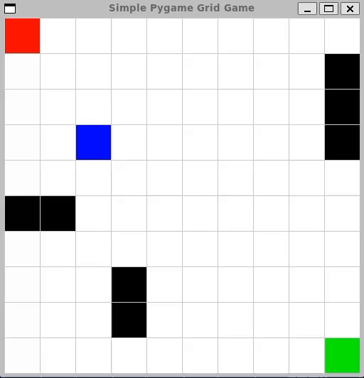

# AgentPlayground
LLM Agent Playground

Example of **gpt-4o** playing a simple game. The model receives a screenshot of the game surface at every iteration and uses tools (functions that it can call) to move.

## Plan
1. Clean and refactor to simplify building new games and agents.
2. Implement new agents using other APIs (e.g. Mistral) and local models (e.g. Llama models).
3. More games/playgrounds.
